<div align="center">
  
  <br/>
  <p align="center">
    <a href="https://harry-aura.github.io/AI-Video-Analytics-for-Border-Surveillance-CCTV/"></a>
    <a href="https://github.com/Harry-aura/AI-Video-Analytics-for-Border-Surveillance-CCTV/blob/main/docs/ARCHITECTURE.md"></a>
    <a href="https://github.com/Harry-aura/AI-Video-Analytics-for-Border-Surveillance-CCTV/blob/main/docs/INTERVIEW_GUIDE.md"></a>
  </p>
  <p align="center">
    <a href="#-core-operational-capabilities"></a>
    <a href="#-edge-hardware--bandwidth-modes"></a>
    <a href="#-iff--patrol-authorization"></a>
    <a href="https://github.com/Harry-aura/AI-Video-Analytics-for-Border-Surveillance-CCTV/blob/main/LICENSE"></a>
  </p>
</div>

---

## 🇮🇳 Project Overview: IBVAP V2

**IBVAP V2 (Integrated Border Video Analytics Platform)** is an enterprise, defense-grade Tactical Command and Control (C2) operations system engineered for the **Smart India Hackathon (SIH)**. Designed for real-time monitoring of harsh, remote demarcation borders, it integrates asynchronous multi-stream neural video processing, ground-coordinate sector radar projection, IFF (Identification Friend or Foe) whitelisting, acoustic anomaly cross-referencing, and instantaneous evidence snapshot dossier logging.

---

## 🖥️ Live Tactical C2 Center (Interactive Web Portal)

Experience the interactive deployment of the IBVAP V2 Command & Control Center:  
👉 **[Launch Live IBVAP V2 Tactical Operations Center](https://harry-aura.github.io/AI-Video-Analytics-for-Border-Surveillance-CCTV/)**

- **4-Quadrant Live Tactical Video Grid**: Real-time bounding box annotations, velocity meters, and vector directional arrows across CAM-01 through CAM-04.
- **IFF Switch Mode**: Toggle targets between Hostile Infiltrators (Red tracking bounds) and Authorized BSF Patrols (Cyan whitelisted bounds).
- **Decoupled Sector Radars**: Interactive 40m range-ring azimuth radar displays mapping target coordinates in real time.
- **Bandwidth Conservation Engine**: Seamlessly switch between Broadband Tactical C2 and 20 kbps low-bandwidth mesh radio telemetry.
- **Incident Evidence Gallery**: Automated boundary breach snapshot logging with SHA-256 evidence export tools.

---

## 🎯 Complete System Architecture

```mermaid
flowchart TB
    subgraph Video_Ingress [Asynchronous 4-Camera Video Array]
        CAM1[CAM-01: North Perimeter Gate] --> Demuxer[Decoupled Async RTSP Stream Buffer]
        CAM2[CAM-02: Sector 4 Perimeter Wire] --> Demuxer
        CAM3[CAM-03: Buffer Zone Approach] --> Demuxer
        CAM4[CAM-04: Vehicle Checkpoint & ANPR] --> Demuxer
    end

    subgraph Inference_Core [Neural Perception & Spatial Tracking]
        Demuxer --> CLAHE[Tactical Optical Filter / Night CLAHE Engine]
        CLAHE --> YOLO[YOLOv8 Object Detector / TensorRT FP16]
        YOLO --> TrackEngine[DeepSORT & Kinematic Trajectory Vector Engine]
        TrackEngine --> IFFJudge{IFF Patrol Whitelist Check?}
        IFFJudge -->|Authorized| FriendlyTag[Emit Cyan Whitelist Tag #104 BSF]
        IFFJudge -->|Unauthorized| HostileTag[Emit Red DEFCON 1 Hostile Vector]
    end

    subgraph C2_Dashboard [Tactical Command & Control Operations]
        FriendlyTag --> StreamlitUI[Streamlit C2 Interface / 4-Quadrant Feeds]
        HostileTag --> StreamlitUI
        HostileTag --> Radars[Decoupled Sector Radars A, B, C, D]
        HostileTag --> EvidenceSnap[Auto-Capture Bounding Breach Snapshot JPEG]
        HostileTag --> Deterrents[GPIO Actuator: Audible Siren & IR Strobe Relay]
    end

    classDef ingress fill:#1e293b,stroke:#3b82f6,stroke-width:2px,color:#fff;
    classDef neural fill:#0f172a,stroke:#10b981,stroke-width:2px,color:#fff;
    classDef c2 fill:#1e1b4b,stroke:#a855f7,stroke-width:2px,color:#fff;
    class CAM1,CAM2,CAM3,CAM4,Demuxer ingress;
    class CLAHE,YOLO,TrackEngine,IFFJudge,FriendlyTag,HostileTag neural;
    class StreamlitUI,Radars,EvidenceSnap,Deterrents c2;
```



---

## ⚡ Core Operational Capabilities

### 1. 🛡️ IFF (Identification Friend or Foe) & Whitelisting
Mitigates friendly-fire and false alarms during scheduled border reconnaissance runs. Authorized BSF patrols entering the camera matrix are cross-referenced with patrol time-windows and biometric/RFID signatures, dynamically transforming threat boundaries from **Critical Red (#f85149)** to **Friendly Cyan (#38bdf8)**.

### 2. 🧭 Decoupled Sector Radars & Azimuth Grids
Translates raw 2D pixel bounding boxes into top-down ground coordinates using inverse homography matrix transformations. Displays sector azimuth cones (Sectors A through D) with 40-meter concentric range rings and bearing markers.

### 3. 📸 Instant Breach Evidence Snapshot Lifecycle
Every boundary tripwire penetration instantly freezes the full-resolution frame, applies cryptographic timestamp and bounding metadata overlays, saves the evidence into `alert_snapshots/`, and prepares a one-click Incident Dossier export.

### 4. 📶 Dual-Mode Telemetry (Broadband vs 20 kbps Mesh)
Under severe satellite or radio degradation, IBVAP V2 switches from full-frame 30 FPS video streaming down to compact 20 kbps JSON telemetry packets containing only kinematic coordinates, class IDs, and threat vectors.

---

## 🚀 Local Development & Execution

```bash
git clone [https://github.com/Harry-aura/AI-Video-Analytics-for-Border-Surveillance-CCTV.git](https://github.com/Harry-aura/AI-Video-Analytics-for-Border-Surveillance-CCTV.git)
cd AI-Video-Analytics-for-Border-Surveillance-CCTV

# Set up virtual environment and install dependencies
python -m venv venv
source venv/bin/activate  # On Windows: .\\venv\\Scripts\\Activate.ps1
pip install -r requirements.txt

# Run the interactive Streamlit C2 Operations Center
streamlit run app.py || python -m streamlit run main.py
```

---

## 📚 Technical Documentation Hub

- [📘 IBVAP V2 Defense Architecture Specification](https://github.com/Harry-aura/AI-Video-Analytics-for-Border-Surveillance-CCTV/blob/main/docs/ARCHITECTURE.md)
- [🔄 Multi-Stream Decoupled RTSP Data Flow](https://github.com/Harry-aura/AI-Video-Analytics-for-Border-Surveillance-CCTV/blob/main/docs/DATA_FLOW.md)
- [📐 Sector Radar Homography & Coordinate Transformation](https://github.com/Harry-aura/AI-Video-Analytics-for-Border-Surveillance-CCTV/blob/main/docs/SYSTEM_DESIGN.md)
- [🎓 SIH / Defense Hackathon Evaluation Guide](https://github.com/Harry-aura/AI-Video-Analytics-for-Border-Surveillance-CCTV/blob/main/docs/INTERVIEW_GUIDE.md)

---

## 👨‍💻 Engineer & Author

**Harivikash Katta**
- **GitHub**: [@Harry-aura](https://github.com/Harry-aura)
- **Project**: IBVAP V2 (Tactical Command & Control Center for Border Defense)
