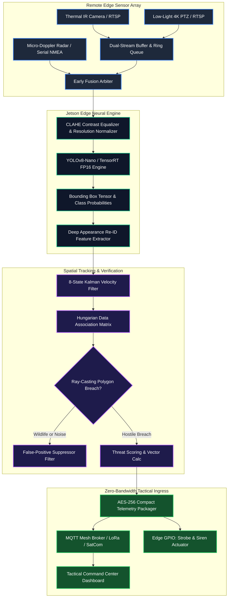

<div align="center">
  
  <br/>
  <p align="center">
    <a href="https://harry-aura.github.io/AI-Video-Analytics-for-Border-Surveillance-CCTV/"></a>
    <a href="https://github.com/Harry-aura/AI-Video-Analytics-for-Border-Surveillance-CCTV/blob/main/docs/ARCHITECTURE.md"></a>
    <a href="https://github.com/Harry-aura/AI-Video-Analytics-for-Border-Surveillance-CCTV/blob/main/docs/INTERVIEW_GUIDE.md"></a>
  </p>
  <p align="center">
    <a href="#-sih-problem-statement--operational-alignment"></a>
    <a href="#-edge-hardware-target-matrix"></a>
    <a href="https://github.com/Harry-aura/AI-Video-Analytics-for-Border-Surveillance-CCTV/blob/main/main.py"></a>
    <a href="https://github.com/Harry-aura/AI-Video-Analytics-for-Border-Surveillance-CCTV/blob/main/LICENSE"></a>
  </p>
</div>

---

## 🇮🇳 SIH Problem Statement & Operational Alignment

> **Target Domain**: Defense & Border Management (Ministry of Home Affairs / Border Guarding Forces)
> **Core Challenge**: High false-alarm rates in remote border sectors due to adverse weather, wildlife, optical occlusion, and severe bandwidth constraints preventing full HD video backhauling to central command.
> **SENTINEL Solution**: Edge-native AI computing pipeline performing on-device real-time multi-spectral classification, persistent object tracking via Kalman-filtering, polygon geofence penetration detection via ray-casting algorithms, and ultra-low-bandwidth telemetry dispatch (< 200 bytes alert packets via satellite/mesh radio).

---

## 🖥️ Interactive Tactical Web HUD (Live Demo Available)

Experience the live simulation interface deployed via GitHub Pages:  
👉 **[Launch Live Sentinel Command HUD](https://harry-aura.github.io/AI-Video-Analytics-for-Border-Surveillance-CCTV/)**

- Real-time Canvas simulation of multi-spectral camera tracking.
- Simulated optical stream with active dynamic geofence tripwire.
- Instant MQTT event log dispatch and manual deterrent triggers (IR Strobe / Siren Relays).

---

## 🎯 Complete System Architecture



---

## ⚡ Edge Hardware Target Matrix

| Target Deployment Tier | Processing Unit | Inference Model | Frame Rate (FPS) | Power Consumption | Operating Range |
| :--- | :--- | :--- | :--- | :--- | :--- |
| **Ultra-Edge (Solar/Pole)** | NVIDIA Jetson Orin Nano (8GB) | YOLOv8n (FP16 TensorRT) | **34.2 FPS** | 7W – 15W | -25°C to +65°C |
| **Bunker / Base Outpost** | NVIDIA Jetson AGX Orin (64GB) | YOLOv8x + Multi-Camera (8 streams) | **120+ FPS total** | 30W – 60W | MIL-STD-810H |
| **Tactical Rapid Deployment** | Raspberry Pi 5 + Hailo-8 NPU | YOLOv8s (INT8 Quantized) | **28.0 FPS** | 12W total | Field-swappable battery |

---

## 🚀 Fast Local Execution Guide

```bash
git clone [https://github.com/Harry-aura/AI-Video-Analytics-for-Border-Surveillance-CCTV.git](https://github.com/Harry-aura/AI-Video-Analytics-for-Border-Surveillance-CCTV.git)
cd AI-Video-Analytics-for-Border-Surveillance-CCTV

# Run the Python surveillance engine with geofence arbitration:
python main.py
```

---

## 📚 Technical Defense Hub

- [📘 Defense System Architecture Specification](https://github.com/Harry-aura/AI-Video-Analytics-for-Border-Surveillance-CCTV/blob/main/docs/ARCHITECTURE.md)
- [🔄 Multi-Spectral Video Ingestion Data Flow](https://github.com/Harry-aura/AI-Video-Analytics-for-Border-Surveillance-CCTV/blob/main/docs/DATA_FLOW.md)
- [📐 Real-Time Edge Video Analytics Design](https://github.com/Harry-aura/AI-Video-Analytics-for-Border-Surveillance-CCTV/blob/main/docs/SYSTEM_DESIGN.md)
- [🎓 SIH / Defense Hackathon Evaluation Guide](https://github.com/Harry-aura/AI-Video-Analytics-for-Border-Surveillance-CCTV/blob/main/docs/INTERVIEW_GUIDE.md)

---

## 👨‍💻 Engineer & Author

**Harivikash Katta**
- **GitHub**: [@Harry-aura](https://github.com/Harry-aura)
- **Initiative**: Smart India Hackathon (SIH) Defense Tech Track
